# 💡 Desafio Técnico: Agente Bancário Inteligente


Um agente de IA conversacional para o banco fictício _Banco Ágil, construído com o \*\*Google Agents Development Kit (ADK)_ e _modelos de linguagem avançados (LLMs)_.  
O agente é capaz de autenticar clientes, analisar pedidos de crédito, realizar cotações de câmbio e conduzir entrevistas para coleta de dados.

---

## 🗂️ Sumário

[📄 Visão Geral do Projeto](#visao-geral-do-projeto)

[🏛️ Arquitetura do Sistema](#arquitetura-do-sistema)

[🔑 Configuração de APIs](#configuracao-de-apis)

[🔗 Como rodar a Aplicação](#como-rodar-a-aplicacao)

---

<a id="desafio-proposto"></a>

## Desafio Proposto

### 🔹 Cenário

Criar um sistema de atendimento para um banco digital fictício (**Banco Ágil**) utilizando agentes de IA.  
Cada agente tem uma função específica, e o atendimento simula uma interação única, mesmo com múltiplos agentes atuando nos bastidores.

---

### 🤖 Agentes do Sistema

<a id="agente-triagem"></a>

#### 🔑 Agente de Triagem

- Autentica o cliente (CPF e data de nascimento, usando `clientes.csv`).
- Fluxo:
  1. Saudação
  2. Coleta CPF e data de nascimento
  3. Validação na base
  4. Redireciona ao agente adequado
  5. Até 3 tentativas de autenticação

---

<a id="agente-credito"></a>

#### 💳 Agente de Crédito

- Consulta limite de crédito atual.
- Solicitação de aumento de limite:
  - Registra pedido em `solicitacoes_aumento_limite.csv`.
  - Aprova ou rejeita com base no score (`score_limite.csv`).
- Se rejeitado, oferece redirecionamento para o Agente de Entrevista de Crédito.

---

<a id="agente-entrevista"></a>

#### 🗣️ Agente de Entrevista de Crédito

- Coleta dados financeiros para recalcular o score:
  - Renda mensal
  - Tipo de emprego
  - Despesas fixas
  - Número de dependentes
  - Dívidas ativas
- Calcula novo score (0 a 1000) e atualiza `clientes.csv`.

---

<a id="agente-cambio"></a>

#### 💱 Agente de Câmbio

- Consulta cotação do dolar em tempo real via API externa.

---

### 📜 Regras Gerais

- Atendimento único, mesmo com múltiplos agentes atuando.
- Tom educado, objetivo e controle de erros.
- Usuário pode encerrar a qualquer momento.
- Agentes agem dentro de seus escopos.

---

<a id="visao-geral-do-projeto"></a>

## 📄 Visão Geral do Projeto

Este projeto é uma solução para o _"Desafio Técnico: Agente Bancário Inteligente", que visa criar um sistema de atendimento ao cliente para um banco digital fictício, o \*\*Banco Ágil_.

A solução utiliza o _Google ADK_, um framework para desenvolver e implementar agentes de IA.  
O sistema interpreta as intenções do cliente e aciona as ferramentas e subagentes apropriados para cada tarefa, simulando um time de especialistas em:

- _Crédito_
- _Câmbio_
- _Entrevistas_

---

<a id="arquitetura-do-sistema"></a>

## 🏛️ Arquitetura do Sistema

A espinha dorsal deste projeto é construída sobre o _Google Agents Development Kit (ADK)_, que permite a criação de sistemas de agentes complexos e modulares.

### Estrutura Geral:

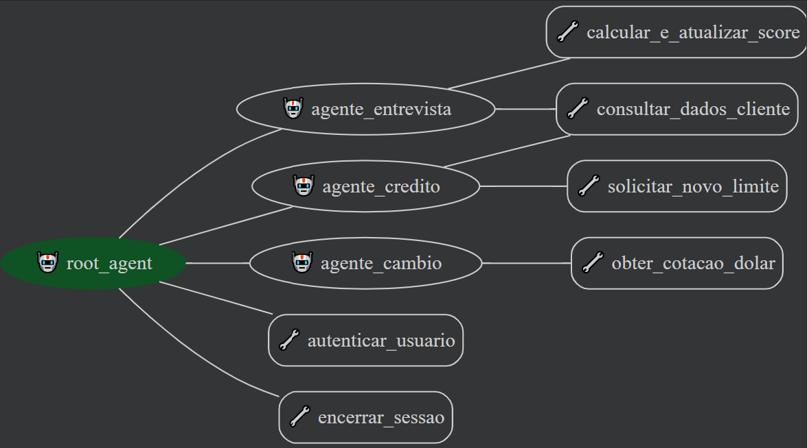

- Um _agente principal (root_agent)_ que orquestra a interação.
- Vários _subagentes especialistas_ para tarefas específicas.
- Integração com _diferentes LLMs_ via _LiteLLM_.

### Principais Arquivos:

- agent.py → Onde todos os agentes e ferramentas são definidos e conectados.
- server.py → Camada de API para comunicação externa (ex: frontend ou chatbot UI).
- agente_cambio.py
- agente_credito.py
- agente_entrevista.py
- descrições e instruções em arquivos separados (pasta descriptions e instructions).
- Frontend básico usando o vite como acelerador.

- #### agent.py:

  Esse é o núcleo do agente, sendo responsável por definir a sessão (conversa atual do agente, gerenciando memória, agentes, etc.) e o agente inicial, o autenticador (definido como root_agent para não sair do padrão definido pelo adk). O agente autenticador tem como sub-agentes (agentes que podem ser chamados à partir dele) o agente credito, cambio e entrevista, cada um com a sua devida especialização. O agente autenticador tem como ferramentas (funções python que ele pode invocar) a função autenticar_usuario, que recebe um cpf e uma data de nascimento e retorna os dados do usuário, permitindo assim que o agente possa autenticar pelo chat e passar o contexto para o agente mais adequado.

  #### agent_cambio.py:

  Arquivo responsável por definir o agente especializado em operações de câmbio.  
  Nele, é implementada a lógica para consultar a cotação do dólar em tempo real, utilizando uma API externa.  
  O agente recebe solicitações do agente principal, realiza a chamada à API e retorna a cotação atualizada ao usuário, garantindo respostas rápidas e precisas sobre valores de câmbio.

  Principais pontos:

  - Implementa a função de consulta de câmbio.
  - Integração com APIs externas para obter a cotação do dólar.
  - Retorna informações formatadas para o usuário final.
  - Atua apenas quando acionado pelo agente principal, mantendo o escopo restrito a operações de câmbio.

  #### agent_credito.py:

  Arquivo responsável por definir o agente especializado em operações de crédito.

  Nele, está implementada a lógica para:

  - Consultar o limite de crédito atual do cliente, utilizando informações do arquivo `clientes.csv`.
  - Registrar solicitações de aumento de limite em `solicitacoes_aumento_limite.csv`.
  - Avaliar pedidos de aumento de limite com base no score do cliente, consultando o arquivo `score_limite.csv`.
  - Aprovar ou rejeitar solicitações automaticamente, seguindo critérios definidos.
  - Em caso de rejeição, oferecer ao cliente a opção de ser encaminhado ao Agente de Entrevista de Crédito para reavaliação.

  Principais pontos:

  - Centraliza todas as operações relacionadas a crédito.
  - Garante que apenas clientes autenticados possam solicitar aumento de limite.

  #### agent_entrevista.py:

  Arquivo responsável por definir o agente especializado em entrevistas de crédito.

  Neste módulo, o agente conduz uma entrevista estruturada com o cliente para coletar informações financeiras detalhadas, essenciais para recalcular o score de crédito. O fluxo da entrevista inclui perguntas sobre renda mensal, tipo de emprego, despesas fixas, número de dependentes e dívidas ativas. Com base nas respostas, o agente calcula um novo score (de 0 a 1000) e atualiza o arquivo `clientes.csv` com o valor revisado.

  Principais pontos:

  - Realiza perguntas de forma sequencial e clara, garantindo a coleta de todos os dados necessários.
  - Valida as respostas fornecidas pelo cliente, solicitando correções em caso de inconsistências.
  - Calcula o novo score de crédito utilizando critérios definidos no sistema.
  - Atualiza o cadastro do cliente com o novo score, permitindo uma nova avaliação de crédito.
  - Atua apenas quando acionado pelo agente de crédito, mantendo o escopo restrito à reavaliação de perfil financeiro.

---

<a id="configuracao-de-apis"></a>

## 🔑 Configuração de APIs

O projeto é flexível quanto ao LLM que você pode usar, graças ao _LiteLLM_, que oferece compatibilidade com diversas APIs do mercado.

Para este projeto, utilizei _APIs gratuitas, como o \*\*Mistral_.

> _Observação:_ Usando um modelo pago, a precisão e performance podem melhorar consideravelmente.

### ✅ Variáveis necessárias (.env)

Crie um arquivo chamado .env no mesmo diretório do server.py (BancoAgil) com o seguinte conteúdo:

MISTRAL_API_KEY=xxxx  
TAVILY_API_KEY=xxxx  
GOOGLE_API_KEY=xxxx

### 📌 Links úteis para gerar suas API Keys:

- [🔑 Obter API Key do Tavily](https://app.tavily.com/home)
- [🔑 Obter API Key do Mistral](https://console.mistral.ai/api-keys)
- [📈 Tabela de Preços do Mistral](https://mistral.ai/pricing#api-pricing)
- [🔑 Gerar API Key do Google Gemini](https://aistudio.google.com/app/apikey)
- [📚 Documentação dos Modelos Gemini](https://ai.google.dev/gemini-api/docs/models)
- [✅ Lista de LLMs suportados pelo LiteLLM](https://docs.litellm.ai/docs/providers/)

<a id="como-rodar-a-aplicacao"></a>

## 🔗 Como rodar a Aplicação

1. **Clone o repositório:**

```bash
git clone https://github.com/RyanMazzeu/Tech_Lab.git
cd Tech_Lab-main
```

2. **Instale as dependências do backend:**

```bash
cd BancoAgil
pip install -r requirements.txt
```

3. **Configure as variáveis de ambiente:**

- Crie um arquivo `.env` na pasta `BancoAgil` com suas chaves de API (veja seção anterior).

4. **Execute o backend:**

- Para testes com a ferramenta nativa do ADK:
  ```bash
  adk web (no mesmo diretorio que os diretórios BancoAgil e BancoAgil_Front)
  ```
- Para rodar o servidor de API:
  ```bash
  python server.py
  ```

5. **(Opcional) Rode o frontend:**

```bash
cd ../BancoAgil_Front
npm install
npm run dev
```

Para executar o projeto, primeiramente é necessário instalar todas as dependências Python listadas no arquivo requirements.txt localizado na pasta BancoAgil.
Caso deseje utilizar o frontend desenvolvido, basta acessar a pasta BancoAgil_Front e executar o comando npm install para instalar todas as dependências do projeto frontend.
Como o sistema foi desenvolvido utilizando o Google Agents Development Kit (ADK), a forma mais prática de realizar testes é por meio da ferramenta nativa do ADK. Para isso, basta executar o comando adk web na raiz do projeto, que irá disponibilizar um link com o agente “BancoAgil” ativo. Essa ferramenta permite visualizar e depurar todo o fluxo de atendimento do agente, facilitando o processo de desenvolvimento.
Para rodar a aplicação integrada com o frontend, é necessário iniciar o servidor backend, que é responsável por iniciar o agente e processar as requisições via API. Em paralelo, deve-se executar o comando npm i para instalar as dependencias do projeto e npm run dev dentro da pasta BancoAgil_Front para iniciar o servidor de desenvolvimento do frontend.

## Funcionamento pelo ADK WEB:

É de suma importância lembrar que para rodar com o adk WEB é necessário alterar as insportações do agent.py, adicionando um "." no inicio, exemplo:

from .agents.agente_cambio import create_exchange_agent # type: ignore

from .agents.agente_credito import create_credit_agent # type: ignore

from .agents.agente_entrevista import create_interview_agent # type: ignore

## Funcionamento pelo server:

É de suma importância lembrar que para rodar com o frontend, ou seja, gerando uma api para acessar o agente via requisição web, é necessário alterar as insportações do agent.py, removendo "." no inicio, exemplo:

from agents.agente_cambio import create_exchange_agent # type: ignore

from agents.agente_credito import create_credit_agent # type: ignore

from agents.agente_entrevista import create_interview_agent # type: ignore

## Testes:

### 1. Autenticação de Cliente (Agente de Triagem)

- [✔️] Cliente fornece CPF e data de nascimento válidos e é autenticado com sucesso.
  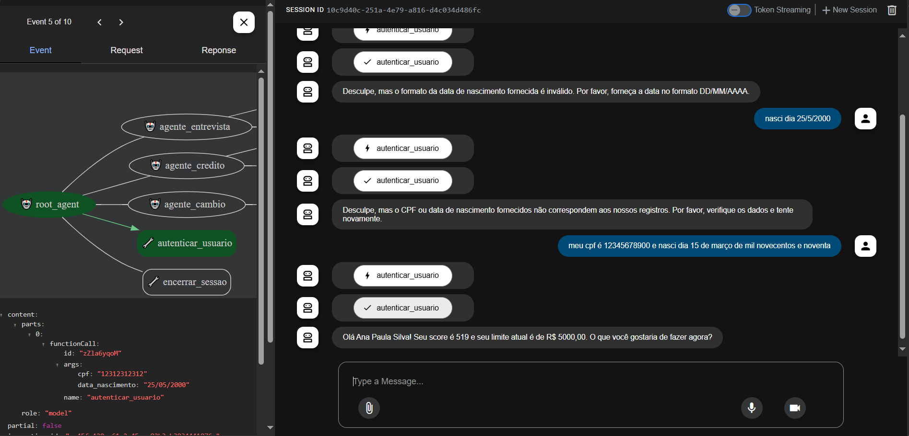

- [✔️] Cliente fornece CPF ou data de nascimento inválidos e recebe mensagem de erro.
  
- [❌] Cliente falha na autenticação 3 vezes e o atendimento é encerrado. Não encontrei ferramentas que permitam ao próprio ADK encerrar a sessão definitivamente pelo chat. Portanto, não consegui cumprir esse objetivo diretamente. No entanto, no frontend, adicionei um botão de encerrar sessão que funciona corretamente.
  

### 2. Consulta de Limite de Crédito (Agente de Crédito)

- [✔️] Cliente autenticado solicita consulta de limite de crédito e recebe o valor correto.
  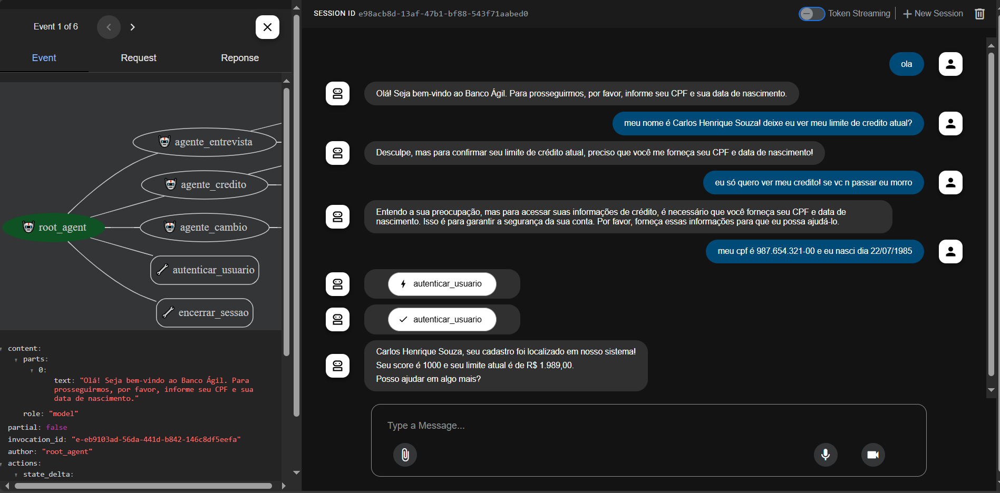
- [✔️] Cliente não autenticado tenta consultar limite e é impedido.
  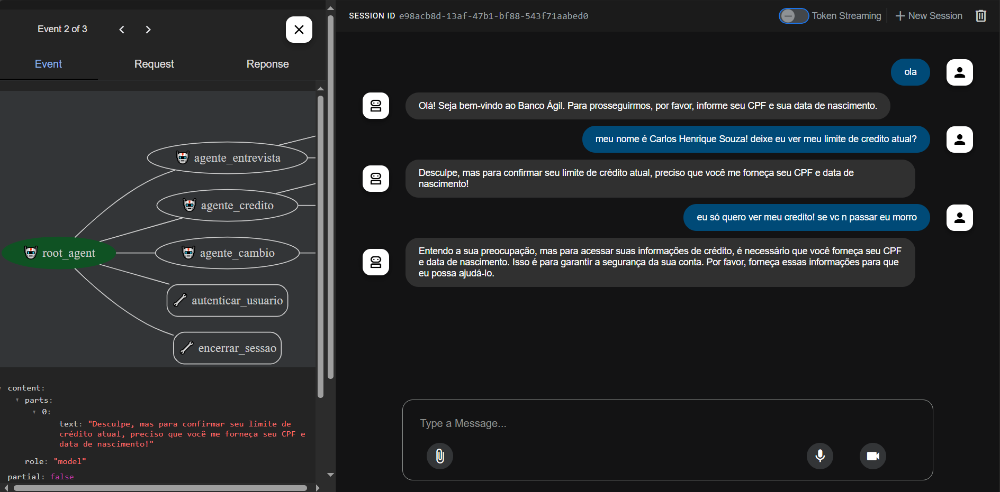

### 3. Solicitação de Aumento de Limite (Agente de Crédito)

- [✔️] Cliente autenticado solicita aumento de limite e pedido é registrado em `solicitacoes_aumento_limite.csv`.
  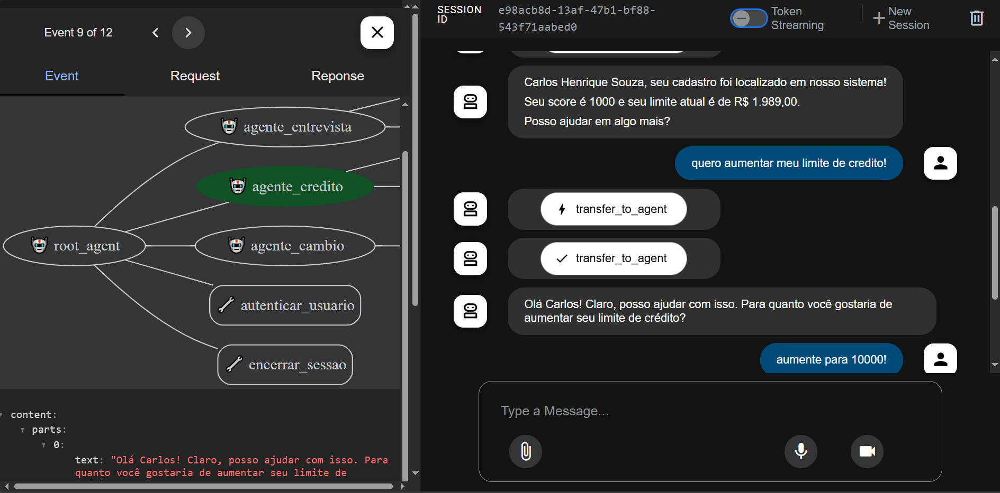
  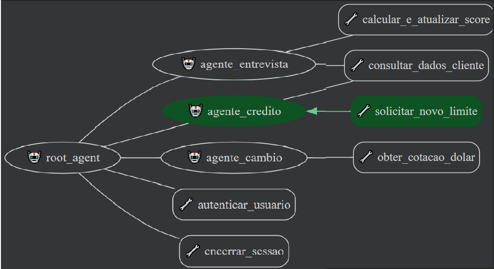
  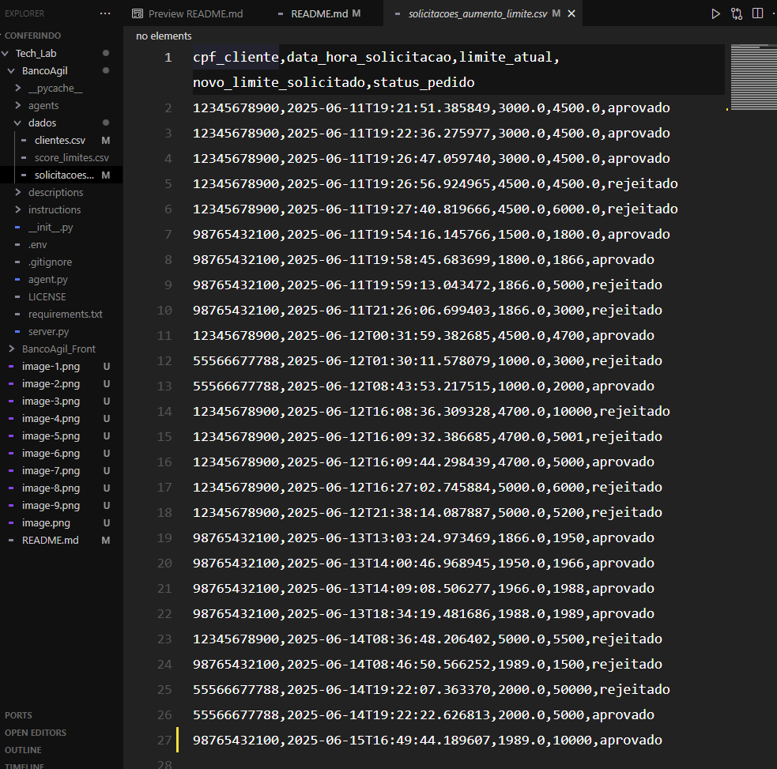
- [✔️] Pedido de aumento é aprovado automaticamente (score suficiente).
  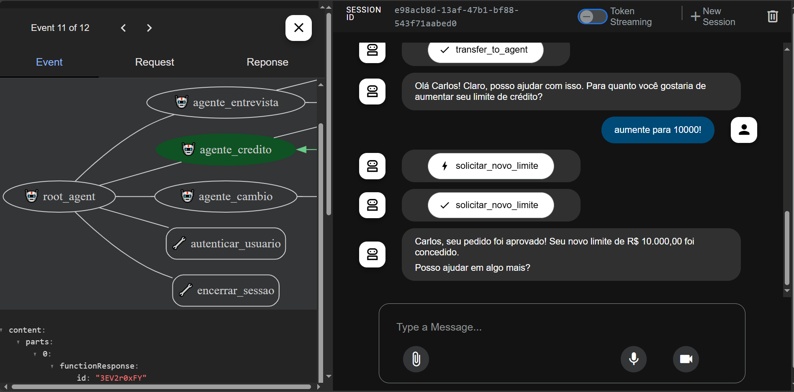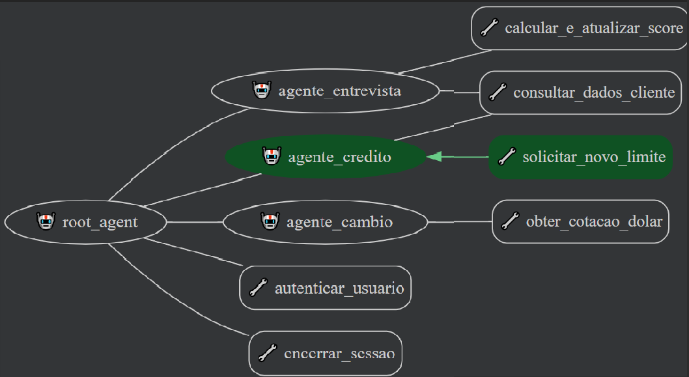
- [✔️] Pedido de aumento é rejeitado automaticamente (score insuficiente).
  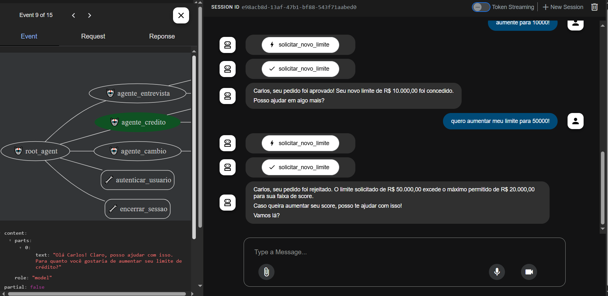
- [✔️] Após rejeição, cliente é convidado a participar da entrevista de crédito.
  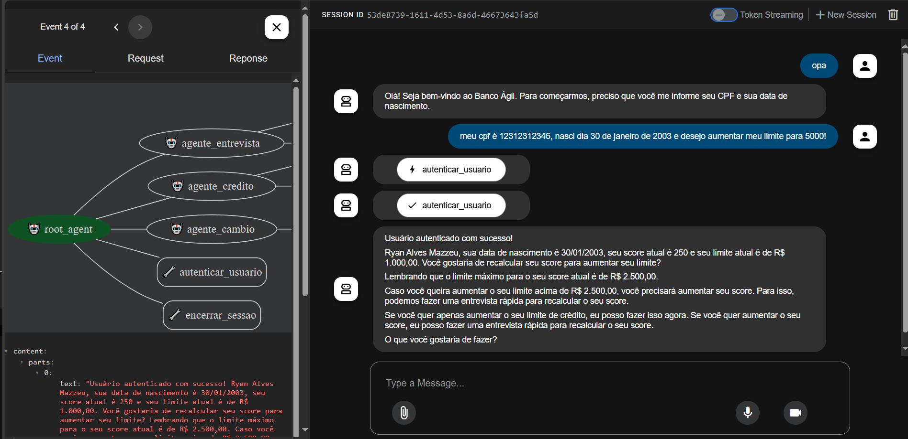

### 4. Entrevista de Crédito (Agente de Entrevista)

- [✔️] Cliente aceita participar da entrevista após rejeição do aumento de limite.
  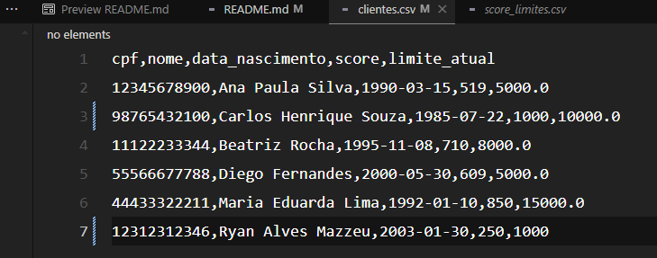
  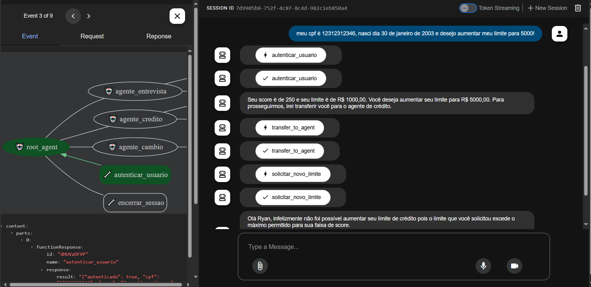
  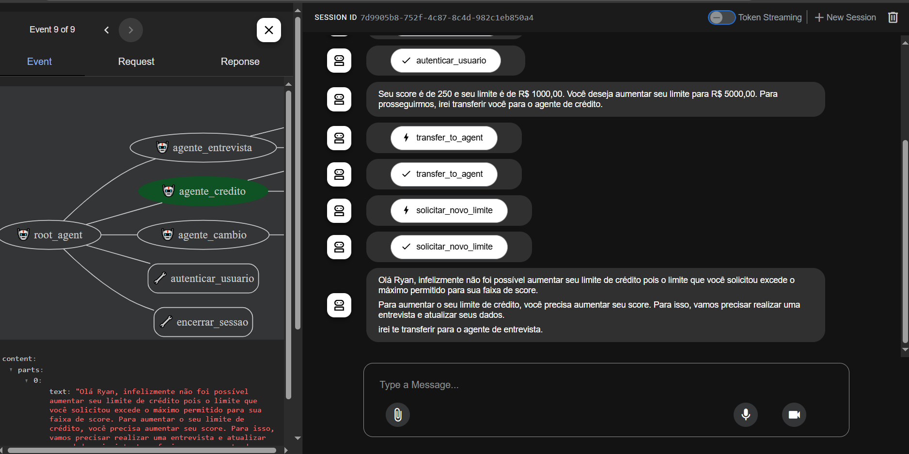
  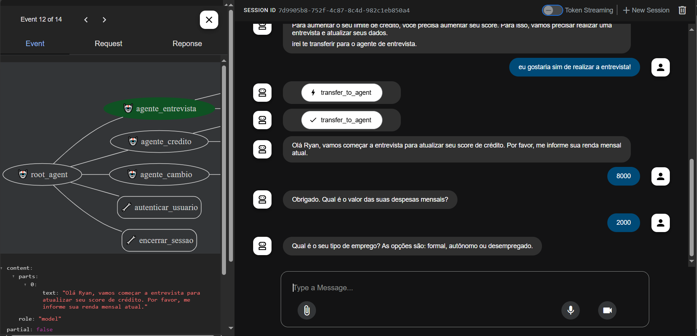
- [✔️] Todas as perguntas da entrevista são feitas (renda, emprego, despesas, dependentes, dívidas).
  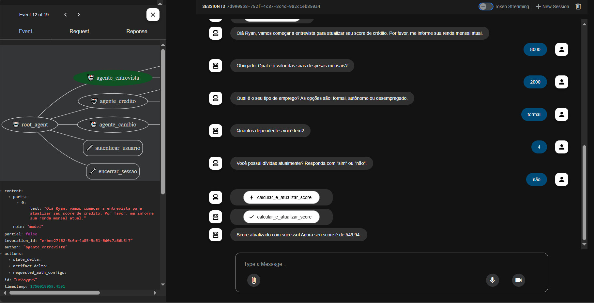
- [✔️] Novo score é calculado corretamente e atualizado em `clientes.csv`.
  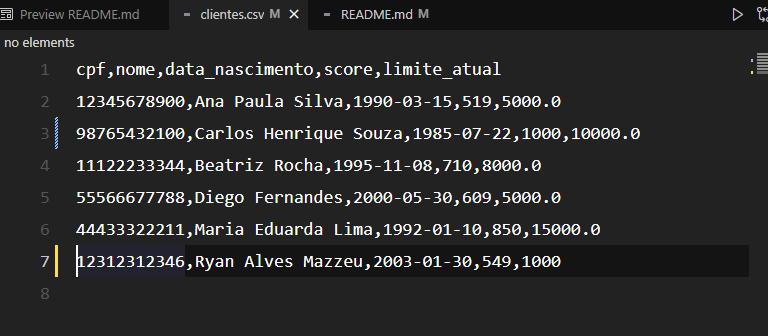

### 5. Consulta de Câmbio (Agente de Câmbio)

- [✔️] Cliente autenticado solicita cotação do dólar e recebe valor atualizado da API externa.
  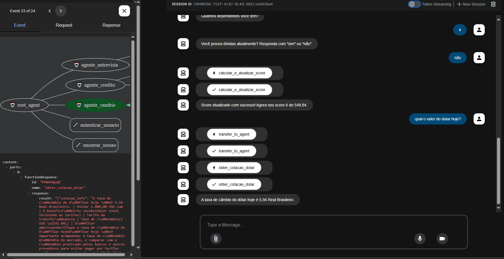

### 6. Fluxo de Atendimento Único

- [✔️] O atendimento é conduzido de forma única, mesmo com múltiplos agentes atuando.
- [❌] O agente não deve falar que transferiu para outro agente.
- [✔️] O contexto do cliente é mantido entre os agentes.

### 7. Controle de Escopo dos Agentes

- [✔️] Cada agente só executa funções dentro do seu escopo (ex: agente de câmbio não acessa dados de crédito).

### 8. Frontend

- [✔️] Frontend comunica corretamente com o backend.
- [✔️] Mensagens e fluxos são exibidos corretamente ao usuário.
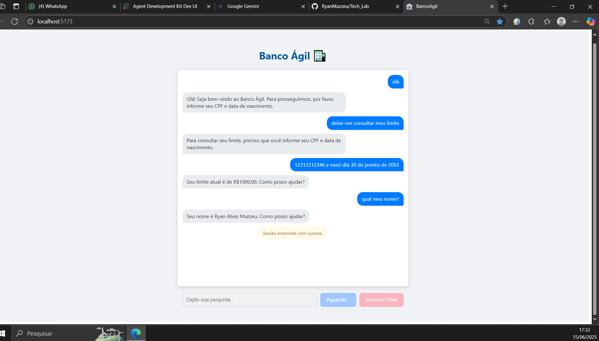